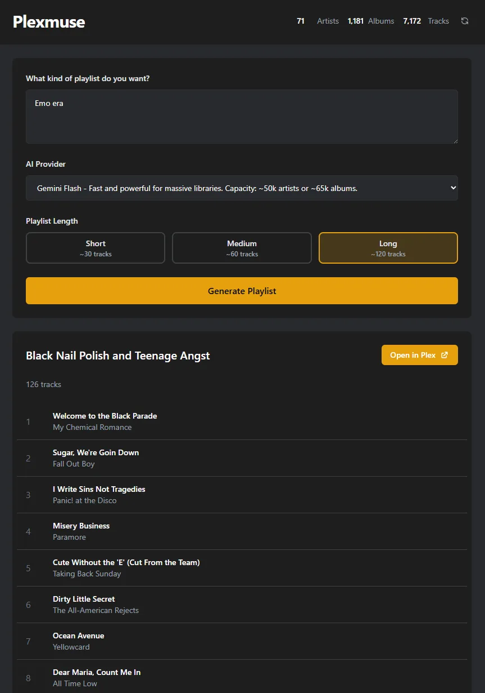

# Plexmuse 🎶🤖

Welcome to **Plexmuse**! This project leverages the power of AI to generate personalized playlists from your Plex music library. Whether you're looking for new music recommendations or creating the perfect playlist for any occasion, this API has got you covered.

## Features ✨

- **AI-Powered Recommendations**: Generate playlists using advanced language models like GPT-4, Claude, and Gemini.
- **Multiple LLM Providers**: Choose from OpenAI, Anthropic, or Google Gemini models with optimized temperature settings per provider.
- **Seamless Plex Integration**: Fetch and manage your music library directly from Plex.
- **Library Statistics**: View your music library stats (artists, albums, tracks) at a glance.
- **Smart Caching**: Library data is cached for fast performance with manual refresh when you add new music.
- **Customizable Playlists**: Tailor your playlists with specific prompts and adjustable playlist lengths (short/medium/long).

## Getting Started 🚀

### Prerequisites

- Docker
- Plex Media Server with a Music library
- <strong>At least one LLM API key:</strong>
  - OpenAI API Key (for GPT-5, GPT-5 mini, GPT-5 nano)
  - Anthropic API Key (for Claude Sonnet 4.5, Claude Haiku 3)
  - Google Gemini API Key (for Gemini Flash)

### Installation

Create a `docker-compose.yml` file:

```yaml
services:
  plexmuse:
    image: ghcr.io/rairulyle/plexmuse:latest
    ports:
      - "8000:8000"
    environment:
      - PLEX_BASE_URL=http://your-plex-server:32400
      - PLEX_TOKEN=your-plex-token
    #   - OPENAI_API_KEY=
    #   - ANTHROPIC_API_KEY=
    #   - GEMINI_API_KEY=
    restart: unless-stopped
```

**Finding your Plex credentials:**

- `PLEX_BASE_URL`: Your Plex server URL (e.g., `http://192.168.1.100:32400`)
- `PLEX_TOKEN`: See [Finding an Authentication Token](https://support.plex.tv/articles/204059436-finding-an-authentication-token-x-plex-token/)

Start the application:

```sh
docker compose up -d
```

The application will be available at `http://localhost:8000`

### Development

1. **Clone the repository**:

   ```sh
   git clone git@github.com:rairulyle/plexmuse.git
   cd plexmuse
   ```

2. **Set up environment variables**:

   ```sh
   cp .env.example .env
   # Edit .env with your configuration
   ```

3. **Run with Docker Compose**:

   ```sh
   docker compose up -d
   ```

## Usage 📖

### User Interface

Access the user interface at the specified port (default: `8000`). This UI allows you to interact with the API, select playlist length, and is mobile-friendly.


The UI includes:

- **AI Provider Selector**: Choose from available LLM providers based on your configured API keys
- **Playlist Length Options**: Short (~30 tracks), Medium (~60 tracks), or Long (~120 tracks)
- **Library Stats**: View your music library statistics in the header
- **Refresh Button**: Manually refresh the library cache when you add new music to Plex

### API

Send a POST request to `/recommendations` with the following JSON body:

```json
{
  "prompt": "Chill vibes for a rainy day",
  "model": "anthropic/claude-sonnet-4-5-20250929",
  "min_tracks": 10,
  "max_tracks": 20
}
```

#### Available Endpoints

| Endpoint           | Method | Description                                  |
| ------------------ | ------ | -------------------------------------------- |
| `/`                | GET    | Web UI                                       |
| `/health`          | GET    | Health check with cache size                 |
| `/stats`           | GET    | Library statistics (artists, albums, tracks) |
| `/providers`       | GET    | List available LLM providers                 |
| `/artists`         | GET    | List all cached artists                      |
| `/recommendations` | POST   | Generate a playlist                          |
| `/refresh`         | POST   | Refresh library cache                        |

### API Documentation

Open your browser and navigate to `http://127.0.0.1:8000/docs` to explore the API endpoints.

## Acknowledgements

This project is a fork of [LubergAlexander/plexmuse](https://github.com/LubergAlexander/plexmuse). Thank you to the original author for creating this awesome project!
